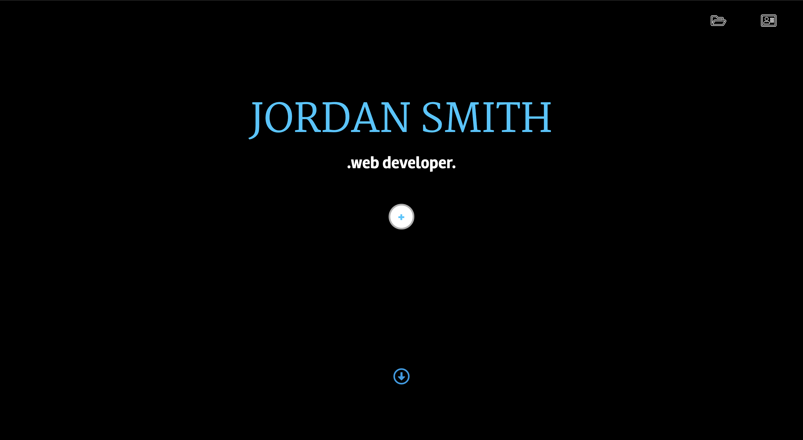

# Portfolio
Updated Portfolio

# Summary
This portfolio was designed to showcase my recent projects, as well as provide some biographical information, résume, and contact information for anyone accessing the page.
    
# Access
My updated portfolio can be accessed [Here](https://jsmithxyz.github.io/new-portfolio/ "Here")

# Installation
This portfolio was built using the CSS framework, Materialize. 
HTML, JavaScript, CSS, JQuery Plugins, Font Awesome, and Google Fonts were used for design and functionality.

# Usage
This portfolio's purpose is to display 'About Me' information, recent projects, as well as contact information.

The icons in the top right of the landing page will scroll the user to the portfolio section and contact sections, respectively, when clicked. 

The pulsing '+' button will open an 'About Me' modal. Here you will also be able to download a PDF version of my Résumé.

When you hit the blue down arrow icon, the screen will scroll to my 'recent projects' section. Here you can click on an image to view the title, and description of each app. You can click the 'View App' button to then go to a deployed version of the application.

Below that section, there is a white down arrow that will scroll to the 'Contact' section when clicked. Here you will be able to acces my Phone Number, E-mail, LinkedIn profile, and Github profile.

